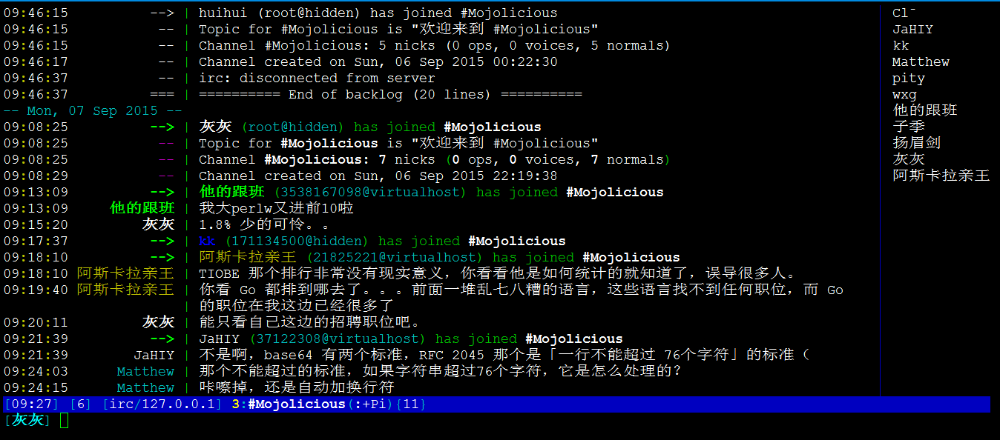
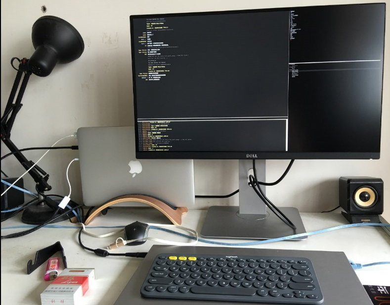

Mojo-Webqq v2.0.5 [](https://travis-ci.org/sjdy521/Mojo-Webqq) [](https://gitter.im/sjdy521/Mojo-Webqq?utm_source=badge&utm_medium=badge&utm_campaign=pr-badge&utm_content=badge) [](API.md) [](http://jq.qq.com/?_wv=1027&k=kjVJzo) [](http://irc.perfi.wang/?channel=#Mojo-Webqq)
========================

使用Perl语言编写的Smartqq客户端框架，基于Mojolicious，要求Perl版本5.10+，可通过插件提供基于HTTP协议的api接口供其他语言或系统调用

###郑重声明

本项目完全遵循QQ官方提供的原始功能，不包含任何破坏、盗号等行为，本项目完全开源，目的是为了促进技术交流学习，禁止任何对国家、企业、个人等构成危害的非法用途，否则后果自负

###特色功能

* 支持 群组踢人、禁言、设置/取消管理员、修改群成员名片、邀请好友入群、群签到
* 支持 获取好友、群组、群成员的真实QQ号码
* 支持 新增/失去好友、新增/退出群组、新增/失去群成员 等事件提醒（非实时）
* 支持 Windows/Linux/Mac 多平台，支持docker镜像，易安装部署，不懂Perl也能用
* 提供 基于HTTP协议的API接口 ，简洁丰富，方便和其他编程语言集成
* 一个产品狗的倾情之作，代码由内而外都更加注重“用户体验”，外加主人人品极好，你懂的

###插件列表

|名称                | 优先级  |当前状态    |github作者    | 功能说明                 
|:-------------------|:--------|:-----------|:-------------|:----------------------------
|[ShowMsg](https://metacpan.org/pod/distribution/Mojo-Webqq/doc/Webqq.pod#Mojo::Webqq::Plugin::ShowMsg)             |100      |已发布      |sjdy521       |打印客户端接收和发送的消息
|[GroupManage](https://metacpan.org/pod/distribution/Mojo-Webqq/doc/Webqq.pod#Mojo::Webqq::Plugin::GroupManage)         |100      |已发布      |sjdy521       |群管理，入群欢迎、限制发图频率等
|[IRCShell](https://metacpan.org/pod/distribution/Mojo-Webqq/doc/Webqq.pod#Mojo::Webqq::Plugin::IRCShell)            |99       |已发布      |sjdy521       |Linux环境下通过irc客户端使用qq
|[Openqq](https://metacpan.org/pod/distribution/Mojo-Webqq/doc/Webqq.pod#Mojo::Webqq::Plugin::Openqq)              |98       |已发布      |sjdy521       |提供qq发送消息api接口
|[Perlcode](https://metacpan.org/pod/distribution/Mojo-Webqq/doc/Webqq.pod#Mojo::Webqq::Plugin::Perlcode)            |97       |已发布      |sjdy521       |通过qq消息执行perl代码
|[Perldoc](https://metacpan.org/pod/distribution/Mojo-Webqq/doc/Webqq.pod#Mojo::Webqq::Plugin::Perldoc)             |96       |已发布      |sjdy521       |通过qq消息查询perl文档
|[Translation](https://metacpan.org/pod/distribution/Mojo-Webqq/doc/Webqq.pod#Mojo::Webqq::Plugin::Translation)         |93       |已发布| sjdy521 | 多国语言翻译功能
|[KnowledgeBase](https://metacpan.org/pod/distribution/Mojo-Webqq/doc/Webqq.pod#Mojo::Webqq::Plugin::KnowledgeBase)       |3        |已发布      |sjdy521       |自定义可编辑问答知识库
|[Qiandao](https://metacpan.org/pod/distribution/Mojo-Webqq/doc/Webqq.pod#Mojo::Webqq::Plugin::Qiandao)          |1        |已发布      |sjdy521       |QQ群每日签到
|[PostQRcode](https://metacpan.org/pod/distribution/Mojo-Webqq/doc/Webqq.pod#Mojo::Webqq::Plugin::PostQRcode)          |0        |已发布      |sjdy521       |登录二维码发送到邮箱实现远程扫码
|[UploadQRcode](https://metacpan.org/pod/distribution/Mojo-Webqq/doc/Webqq.pod#Mojo::Webqq::Plugin::UploadQRcode)          |0        |已发布      |sjdy521       |二维码上传图床获得公网访问url
|[ShowQRcode](https://metacpan.org/pod/distribution/Mojo-Webqq/doc/Webqq.pod#Mojo::Webqq::Plugin::ShowQRcode)          |0        |已发布      |autodataming  |调用系统图片查看程序来示二维码（目前仅支持win）
|[SmartReply](https://metacpan.org/pod/distribution/Mojo-Webqq/doc/Webqq.pod#Mojo::Webqq::Plugin::SmartReply)          |0        |已发布      |sjdy521       |智能聊天回复

更多插件参考[完整插件列表](Plugin.md)

###效果展示

敲一行命令就能启动一个智能聊天机器人，Perl 和你都如此优雅. Enjoy!

    cpanm Mojo::Webqq && perl -MMojo::Webqq -e "Mojo::Webqq->new->load('ShowMsg')->load('SmartReply')->run()"

```
[15/09/30 15:11:59] [info] 初始化 smartqq 客户端参数...
[15/09/30 15:11:59] [info] 检查验证码...
[15/09/30 15:11:59] [info] 检查结果: 很幸运，本次登录不需要验证码
[15/09/30 15:11:59] [info] 正在获取登录二维码...
[15/09/30 15:11:59] [info] 二维码已下载到本地[ /tmp/mojo_webqq_qrcode_xxx.png ]
[15/09/30 15:12:00] [info] 登录二维码已经发送到邮箱: ******
[15/09/30 15:12:00] [info] 等待手机QQ扫描二维码...
[15/09/30 15:12:43] [info] 手机QQ扫码成功，请在手机上点击[允许登录smartQQ]按钮...
[15/09/30 15:12:46] [info] 检查安全代码...
[15/09/30 15:12:47] [info] 设置登录验证参数...
[15/09/30 15:12:47] [info] 尝试进行登录(2)...
[15/09/30 15:12:47] [info] 登录成功
[15/09/30 15:12:47] [info] 更新个人信息...
[15/09/30 15:12:47] [info] 更新好友信息...
[15/09/30 15:12:47] [info] 更新[ PERL学习交流 ]信息
[15/09/30 15:12:52] [info] 更新[ Mojolicious ]信息
[15/09/30 15:12:55] [info] 开始接收消息...
[15/09/30 14:09:20] [群消息] 小灰|PERL学习交流 : Mojo::Webqq不错哦
[15/09/30 14:10:20] [群消息] 我->PERL学习交流 : 多谢多谢
```

####通过irc客户端在linux终端上使用QQ

```

    +-------------------+                      +----------------+  
    |  Tencent          |                      | Any IRC Client |
    |  SmartQQ Server   |                      | wechat、irssi  |
    +---v-------------^-+                      +-v------------^-+     
        |             |                          |            |
        | QQ协议交互  |                          |IRC协议交互 |
+-- --- |--  - -  --  | - - -   --   -  -   ---  | ---  ----- | --+
|   +---v-------------^--+                  +----v------------^-+ |   
|   |                    <——————————————————<                   | |
|   |   SmartQQ Client   |     QQ - IRC     |  IRC Server       | |
|   |                    |     协议转换     |  监听本机6667端口 | |
|   |                    >——————————————————>                   | | 
|   +--------------------+                  +-------------------+ |
|                                                                 |
|                                       我们程序实现的部分        | 
+---  - - - -  -- - --  ----  ------  -------  ------  ---    ----+

```



####IT男装逼利器：如何像黑客一样聊天（图片来自 @動感光波）



####更多应用效果 请参见[Mojo-Webqq作品展](Collection.md)

###安装方法

推荐使用[cpanm](https://metacpan.org/pod/distribution/App-cpanminus/bin/cpanm)在线安装或升级[Mojo::Webqq](https://metacpan.org/pod/distribution/Mojo-Webqq/doc/Webqq.pod)模块, 如果使用docker方式请参见[Docker镜像安装及使用方法](Docker.md)

1. *安装perl*
  
    安装之前请先确认下你的系统是否已经安装了Perl，因为除了windows，其他大部分的平台默认都可能已经预装过

    并且你的Perl版本至少5.10.1+，推荐5.14+

    [Perl官网下载页面](https://www.perl.org/get.html) 有包含Unix/Linux、Mac OS X、Windows多平台比较全面详细的安装说明

    建议大家尽量选择**Binaries**（二进制预编译）的版本，安装即可使用，比较方便

    |平台    |推荐选择  |下载地址         |
    |:-------|:--------|:---------------|
    |Windows |1. **StrawberryPerl**<br>2. ActivePerl<br>3. **Mojo-StrawberryPerl**|[StrawberryPerl下载地址](http://strawberryperl.com/)<br>[Mojo-StrawberryPerl下载地址](https://github.com/sjdy521/Mojo-StrawberryPerl)<br>[ActivePerl下载地址](http://www.activestate.com/activeperl/downloads)<br>|
    |Linux   |1. **系统自带**<br>2. **yum/apt等包管理器**<br>3. 官方源码编译<br>4. **Mojo-CentosPerl**<br>5. ActivePerl<br>6. Mojo-ActivePerl<br>7. DWIM-Perl|[Mojo-CentosPerl下载地址](https://github.com/sjdy521/Mojo-CentosPerl)<br>[ActivePerl下载地址](http://www.activestate.com/activeperl/downloads)<br>[Mojo-ActivePerl下载地址](https://github.com/sjdy521/Mojo-ActivePerl)<br>[DWIM-Perl下载地址](http://dwimperl.com/linux.html)|
    |Mac     |1. **系统自带**<br>2. ActivePerl|[ActivePerl下载地址](http://www.activestate.com/activeperl/downloads)|
  
    注意：
    
    [Mojo-CentosPerl](https://github.com/sjdy521/Mojo-CentosPerl)是基于Centos系统编译打包而成，适合Centos6.5已上的x86_64系统
    
    [Mojo-ActivePerl](https://github.com/sjdy521/Mojo-ActivePerl)是基于ActivePerl打包的而成，适用于linux x86_64系统，并且系统glibc 2.15+
    
    [Mojo-StrawberryPerl](https://github.com/sjdy521/Mojo-StrawberryPerl)是基于StrawberryPerl精简打包而成，适用于windows 32位/64位系统
    
2. *安装cpanm包管理工具*（如果系统已经安装了cpanm可以忽略此步骤）

    方法a： 通过cpan安装cpanm

        $ cpan -i App::cpanminus
    
    方法b： 直接在线安装cpanm

        $ curl -kL https://cpanmin.us | perl - App::cpanminus
        
        官方服务器在国外，如果无法访问，可以选择下面的命令：
        
        $ curl http://share-10066126.cos.myqcloud.com/cpanm.pl|perl - App::cpanminus

3. *使用cpanm在线安装 Mojo::Webqq 模块*（如果系统已经安装了该模块，执行此步骤会对模块进行升级）

        $ cpanm Mojo::Webqq
    
    如果安装过程中一直提示下载失败，很可能是因为访问到国外服务器网络比较差
    
    这种情况下可以尝试按如下方式手动指定国内的镜像站点
    
        $ cpanm --mirror http://mirrors.163.com/cpan/ Mojo::Webqq

4. *安装失败可能有帮助的解决方法*
        
    如果你运气不佳，通过cpanm没有一次性安装成功，这里提供了一些可能有用的信息

    在安装 Mojo::Webqq 的过程中，cpan或者cpanm会帮助我们自动安装很多其他的依赖模块
    
    在众多的依赖模块中，安装经常容易出现问题的主要是 IO::Socket::SSL
    
    IO::Socket::SSL 主要提供了 https 支持，在安装过程中可能会涉及到SSL相关库的编译

    对于 Linux 用户，通常采用的是编译安装的方式，系统缺少编译安装必要的环境，则会导致编译失败
    
    对于 Windows 用户，由于不具备良好的编译安装环境，推荐采用一些已经打包比较全面的Perl运行环境
    
    例如比较流行的 strawberryperl 或者 activeperl 的最新版本都默认包含 Mojo::Webqq 的核心依赖模块

    RedHat/Centos:

        $ yum install -y openssl-devel
        
    Ubuntu:

        $ sudo apt-get install libssl-dev
    
    搞定了编译和运行环境之后，再重新回到 步骤2 安装Mojo::Webqq即可
        

###如何使用

1. *我对Perl很熟悉，是一个专业的Perler*

    该项目是一个纯粹的Perl模块，已经发布到了cpan上，请仔细阅读 `Mojo::Weqq` 模块的[使用文档](https://metacpan.org/pod/distribution/Mojo-Webqq/doc/Webqq.pod)

    除此之外，你可以看下 [demo](https://github.com/sjdy521/Mojo-Webqq/tree/master/demo) 目录下的更多代码示例

2. *我是对Perl不熟悉，是一个其他语言的开发者，只对提供的消息发送/接收接口感兴趣*

    可以直接把如下代码保存成一个源码文件（必须是UTF-8编码），使用 perl 解释器来运行
    
        #!/usr/bin/env perl
        use Mojo::Webqq;
        my ($host,$port,$post_api);
        
        $host = "0.0.0.0"; #发送消息接口监听地址，没有特殊需要请不要修改
        $port = 5000;      #发送消息接口监听端口，修改为自己希望监听的端口
        #$post_api = 'http://xxxx';  #接收到的消息上报接口，如果不需要接收消息上报，可以删除或注释此行
        
        my $client = Mojo::Webqq->new();
        $client->load("ShowMsg");
        $client->load("Openqq",data=>{listen=>[{host=>$host,port=>$port}], post_api=>$post_api});
        $client->run();
    
    上述代码保存成 xxxx.pl 文件，然后使用 perl 来运行，就会完成 QQ 登录并在本机产生一个监听指定地址端口的 http server
    
        $ perl xxxx.pl
    
    发送好友消息的接口调用示例
    
        http://127.0.0.1:5000/openqq/send_friend_message?uid=xxxxx&content=hello
        
        * About to connect() to 127.0.0.1 port 5000 (#0)
        *   Trying 127.0.0.1...
        * Connected to 127.0.0.1 (127.0.0.1) port 5000 (#0)
        > GET /openqq/send_friend_message?uid==xxxxx&content=hello HTTP/1.1
        > User-Agent: curl/7.29.0
        > Host: 127.0.0.1:5000
        > Accept: */*
        > 
        < HTTP/1.1 200 OK
        < Content-Type: application/json;charset=UTF-8
        < Date: Sun, 13 Dec 2015 04:54:38 GMT
        < Content-Length: 52
        < Server: Mojolicious (Perl)
        <
        * Connection #0 to host 127.0.0.1 left intact
        
        {"status":"发送成功","msg_id":23910327,"code":0}
    
    更多接口参数说明参见[API说明文档](API.md)
    
3.  *我是一个极客，我只想能够在命令行上通过  IRC 的方式来玩转 QQ 聊天*

    请阅读[IRCShell插件使用步骤](IRC.md)

4. *我是一个 QQ 群主或管理员，我想给自己的群加个机器人群管理功能*

    请关注 [GroupManage 插件使用文档](https://metacpan.org/pod/distribution/Mojo-Webqq/doc/Webqq.pod#Mojo::Webqq::Plugin::GroupManage)   


###核心依赖模块

* [Mojolicious](https://metacpan.org/pod/Mojolicious)
* [Encode::Locale](https://metacpan.org/pod/Encode::Locale)

###相关文档

* [更新日志](https://github.com/sjdy521/Mojo-Webqq/blob/master/Changes)
* [开发文档](https://metacpan.org/pod/distribution/Mojo-Webqq/doc/Webqq.pod)

###官方交流

* [QQ群](http://jq.qq.com/?_wv=1027&k=kjVJzo)
* [IRC](http://irc.perfi.wang/?channel=#Mojo-Webqq)

###友情链接

*JavaScript*
* [webqqircd](https://github.com/MaskRay/webqqircd) 用IRC客户端控制WebQQ(SmartQQ)，类似于wechatircd
* [qqbot](https://github.com/floatinghotpot/qqbot) SmartQQ Robot and API Server, powered by node.js
* [qqbot](https://github.com/ScienJus/qqbot) 基于SmartQQ（WebQQ）的QQ机器人 / a qq robot based on smartqq(webqq) api

*Python*
* [SmartQQBot](https://github.com/Yinzo/SmartQQBot) 基于SmartQQ的自动机器人框架
* [qqbot](https://github.com/pandolia/qqbot) A conversation robot base on Tencent's SmartQQ

*Java*
* [smartqq](https://github.com/ScienJus/smartqq) SmartQQ（WebQQ）的Api ，你可以用它实现自己的QQ 机器人

###捐赠奖励

可以通过扫描支付宝付款二维码进行捐赠，感谢您的支持和鼓励


特别致谢 [那些曾经捐赠的小伙伴们](https://github.com/sjdy521/Mojo-Thanks)

###COPYRIGHT 和 LICENCE

Copyright (C) 2014 by sjdy521

This library is free software; you can redistribute it and/or modify
it under the same terms as Perl itself, either Perl version 5.10.1 or,
at your option, any later version of Perl 5 you may have available.
